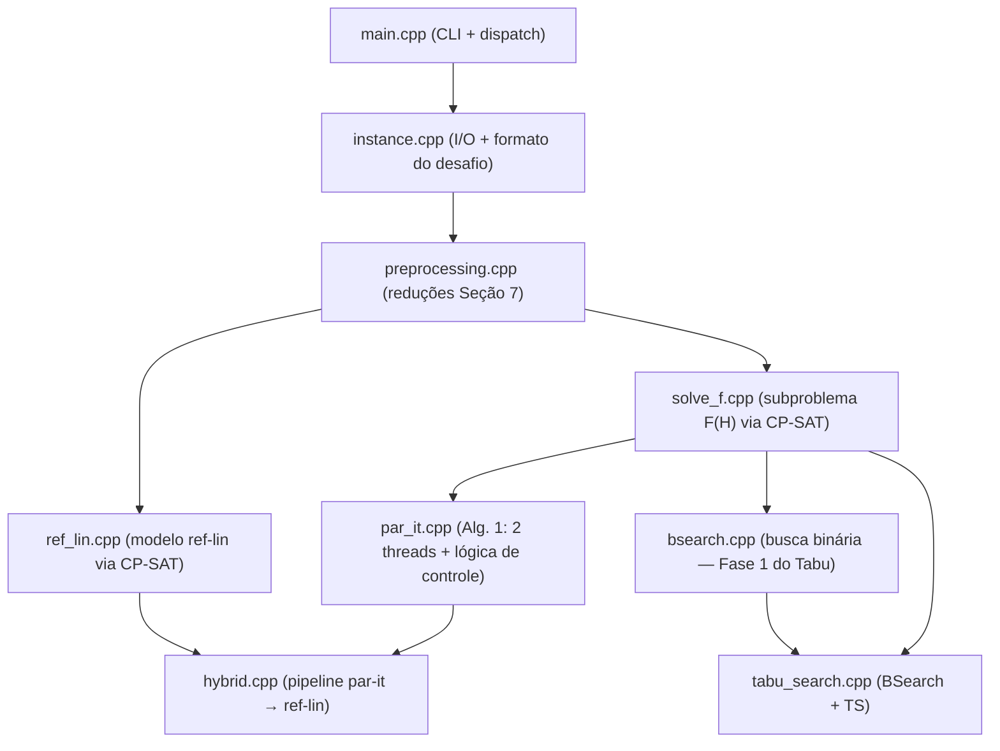

# Design: Implementação dos Algoritmos SPO em C++

**Spec**: `.specs/features/algoritmos-descritivos/spec.md`
**Status**: Draft

---

## Decisão de Solver: OR-Tools CP-SAT

> [!IMPORTANT]
> **OR-Tools CP-SAT** foi escolhido como solver MILP. Razões:
> - API C++ nativa, madura e amplamente documentada
> - Excelente performance em problemas com variáveis binárias (exatamente o caso do SPO)
> - Open-source (Apache 2.0), sem licença comercial
> - Suporte nativo a time limits, multi-thread e cancelamento cooperativo
> - Integração CMake via `find_package(ortools)` ou FetchContent
>
> HiGHS seria alternativa para o `ref-lin` (LP/MIP contínuo com variáveis u, t, g), mas
> CP-SAT lida bem com variáveis contínuas também desde que os coeficientes sejam inteiros
> (o que é verdade aqui — todas as quantidades são inteiras).

---

## Architecture Overview



**Fluxo de execução**:
1. `main.cpp` parseia CLI e carrega a instância via `instance.cpp`
2. `preprocessing.cpp` aplica as 6 reduções da Seção 7 do artigo
3. O método selecionado é invocado, todos reutilizando `solve_f.cpp` como núcleo MILP
4. A solução é escrita em stdout no formato do desafio

---

## Code Reuse Analysis

### Referência Java → C++

| Classe Java (`andre_feijo/`) | Componente C++ | Como aproveitar |
| ---------------------------- | -------------- | --------------- |
| `Instance.java` | `instance.hpp/.cpp` | Portagem direta das estruturas `orders`, `aisles`, `itemsPerOrders`, `itemsPerAisles`, `wontBuild`, `wontUse`, `easy`, `dominated`, `Q`, `D` |
| `Instance.getInstanceInfo()` | `preprocessing.cpp` | Todas as reduções já estão aqui — portagem fiel |
| `MaxSubsetSum.java` | `preprocessing.cpp` | DP de Maximum Subset Sum — portagem direta |
| `ItModel.java` | `solve_f.cpp` | Lógica de montar `F(H)` com `Σ y_a = H`; substituir CPLEX por CP-SAT |
| `ParallelIterative.java` | `par_it.cpp` | Lógica de controle (β, LB dinâmico, MAX_AISLES) — portagem direta com `std::thread` |
| `RefLinFractional.java` | `ref_lin.cpp` | Modelo com u, t_o, g_a — portagem das equações (10)-(21) |
| `BSearch.java` | `bsearch.cpp` | Busca binária sobre H em vez de decremento linear |
| `TSHeuristic.java` | `tabu_search.cpp` | Lógica de controle da TS (mv1/mv2 threads, tabu list, critério de parada) |
| `NgbrModel.java` | `tabu_search.cpp` | Avaliação de vizinhança — embutida no `tabu_search.cpp` usando `solve_f.cpp` |
| `ChallengeSolution.java` | `solution.hpp` | struct simples com `orders` e `aisles` como `vector<int>` |

### Datasets e checker Python

O `checker.py` e os datasets do `andre_feijo/` são reutilizados diretamente — o binário C++
deve produzir output no **mesmo formato** que o Java. O pipeline `pfc2` invocará o binário
e chamará `checker.py` para validação.

---

## Components

### `instance.hpp / instance.cpp`

- **Purpose**: Leitura do arquivo de instância e representação em memória
- **Location**: `spo/src/instance.cpp`, `spo/include/instance.hpp`
- **Interfaces**:
  ```cpp
  struct Instance {
      int n_orders, n_items, n_aisles, LB, UB;
      // Esparso: w[o] = {item -> qty}
      vector<unordered_map<int,int>> orders;
      // Esparso: q[a] = {item -> qty}
      vector<unordered_map<int,int>> aisles;
      // Índices inversos
      vector<unordered_map<int,int>> items_per_order; // items_per_order[i] = {o -> w_{i,o}}
      vector<unordered_map<int,int>> items_per_aisle; // items_per_aisle[i] = {a -> q_{i,a}}
      // Pré-computados
      vector<int> Q; // Q[i] = Σ_a q_{i,a}
      vector<int> D; // D[i] = Σ_o w_{i,o}
  };

  Instance read_instance(const string& path);
  void write_solution(const Solution& sol, ostream& out);
  ```
- **Dependencies**: stdlib (`fstream`, `unordered_map`, `vector`)
- **Reuses**: Lógica de I/O de `Instance.java` (portagem direta)

---

### `preprocessing.hpp / preprocessing.cpp`

- **Purpose**: Aplicar as reduções da Seção 7 do artigo antes de montar qualquer modelo MILP
- **Location**: `spo/src/preprocessing.cpp`, `spo/include/preprocessing.hpp`
- **Interfaces**:
  ```cpp
  struct PreprocResult {
      vector<bool> order_removed;   // wontBuild
      vector<bool> item_removed;    // wontUse
      vector<bool> item_easy;       // easy: qualquer corredor supre toda a demanda
      vector<bool> aisle_dominated; // dominated
      // Q e D atualizados (após cap de oferta e MaxSubsetSum)
  };

  PreprocResult preprocess(Instance& inst);
  ```
- **Dependencies**: `instance.hpp`, `max_subset_sum.hpp`
- **Reuses**: `Instance.getInstanceInfo()` e `MaxSubsetSum.java` (portagem direta)

**Reduções implementadas** (em ordem):
1. Pedidos inviáveis: `∃i: w_{i,o} > Q_i` → `order_removed[o] = true`
2. Pedidos unitários excedentes: `D̄_i > Q_i` → remover `D̄_i - Q_i` pedidos de `O¹_i`
3. Itens órfãos: todos os pedidos do item removidos → `item_removed[i] = true`
4. Cap de oferta: `q_{i,a} = min(q_{i,a}, D_i)`
5. MaxSubsetSum: quando item `i` está em apenas 1 corredor, reduzir `q_{i,a}` via DP
6. Itens "fáceis" (`easy`): qualquer corredor que contém `i` já supre `D_i` → restrição binária

---

### `solution.hpp`

- **Purpose**: Representação da solução e cálculo do objetivo
- **Location**: `spo/include/solution.hpp`
- **Interfaces**:
  ```cpp
  struct Solution {
      vector<int> orders;  // índices dos pedidos selecionados
      vector<int> aisles;  // índices dos corredores visitados
      double objective;    // |π| / |A'|
      bool feasible;
      bool optimal;        // garantidamente ótima?
  };
  ```
- **Dependencies**: nenhuma
- **Reuses**: `ChallengeSolution.java` (portagem)

---

### `solve_f.hpp / solve_f.cpp` ⭐ Núcleo central

- **Purpose**: Resolver o subproblema `F(H)` (equações 22-26) via OR-Tools CP-SAT; reutilizado por `par-it`, `ref-lin`, híbrido e Busca Tabu
- **Location**: `spo/src/solve_f.cpp`, `spo/include/solve_f.hpp`
- **Interfaces**:
  ```cpp
  struct SolveFExtras {
      optional<vector<int>> forced_aisles;   // y_a fixo em 1
      optional<vector<int>> forbidden_aisles; // y_a fixo em 0
      int lb_override = -1;  // substitui LB da instância
      int ub_override = -1;  // substitui UB da instância
  };

  struct SolveFResult {
      bool feasible;
      int items;             // Σ itens coletados
      double obj_value;      // items / H
      vector<int> orders;
      vector<int> aisles;
  };

  // Resolve F(H): max itens com exatamente H corredores
  SolveFResult solve_f(
      const Instance& inst,
      const PreprocResult& preproc,
      int H,
      const SolveFExtras& extras,
      double time_limit_s,
      int n_threads
  );
  ```
- **Dependencies**: OR-Tools CP-SAT (`ortools/sat/cp_model.h`), `instance.hpp`, `preprocessing.hpp`
- **Reuses**: Lógica de `ItModel.java` e `NgbrModel.java` (portagem, substituindo CPLEX por CP-SAT)

**Construção do modelo CP-SAT** (baseado nas equações 22-26):
```
variáveis:
  y[a] ∈ {0,1}  ∀ a ∈ A \ dominated
  p[o] ∈ {0,1}  ∀ o não removido pelo pré-processamento
    (p[o] ∈ [0,1] contínua se o é unitário — CP-SAT trata via relaxação)

restrições:
  Σ y[a] = H                                    (23)
  Σ_o w_{i,o}·p[o] ≤ Σ_a q_{i,a}·y[a]  ∀ i    (24) — exceto itens easy/removed
  p_o ≤ Σ_{a∈A_i} y[a]  ∀ i ∈ easy, ∀ o∈O_i   (restrição binária para itens fáceis)
  LB ≤ Σ_{o,i} w_{i,o}·p[o] ≤ UB              (25)
  p[o] = 0  ∀ o removido                        (fix)
  y[a] = 0  ∀ a dominado                        (fix)
  y[a] = 1  ∀ a ∈ extras.forced_aisles
  y[a] = 0  ∀ a ∈ extras.forbidden_aisles

objetivo:
  max Σ_{o,i} w_{i,o}·p[o]                     (22)
```

**Nota CP-SAT**: CP-SAT trabalha com inteiros; coeficientes fracionários não são permitidos.
Como todos os pesos `w_{i,o}` e quantidades `q_{i,a}` são inteiros, não há problema.
O `lb_override` e `ub_override` são injetados diretamente na restrição (25).

---

### `ref_lin.hpp / ref_lin.cpp`

- **Purpose**: Resolver o modelo `ref-lin` completo (equações 10-21) para otimizar diretamente a razão itens/corredores
- **Location**: `spo/src/ref_lin.cpp`, `spo/include/ref_lin.hpp`
- **Interfaces**:
  ```cpp
  struct RefLinParams {
      int h_min = 1;       // limite inferior de corredores (restrição 33 do híbrido)
      int h_max = -1;      // -1 = sem limite superior (usa |A|)
      double incumbent = 0.0; // incumbente do par-it para apertar bounds
      double time_limit_s = 600.0;
      int n_threads = 8;
  };

  Solution solve_ref_lin(
      const Instance& inst,
      const PreprocResult& preproc,
      const RefLinParams& params
  );
  ```
- **Dependencies**: OR-Tools CP-SAT, `instance.hpp`, `preprocessing.hpp`, `solution.hpp`
- **Reuses**: Lógica de `RefLinFractional.java`

**Nota de implementação**: O modelo `ref-lin` usa variáveis contínuas `u`, `t_o`, `g_a` que
representam `1/Σy_a`, `u·p_o` e `u·y_a`. CP-SAT opera em inteiros; a estratégia é
**escalar** multiplicando por `M = UB` (limitante superior do denominador):

```
u_scaled = M / Σ y_a   → não linearizável diretamente em CP-SAT

Alternativa (preferida): usar LinearProgramming (LP relaxation) do OR-Tools MPSolver
para ref-lin, pois este modelo tem variáveis contínuas verdadeiras.
```

> [!WARNING]
> **CP-SAT não suporta variáveis contínuas com restrições não-lineares.** O modelo `ref-lin`
> original (com u, t_o, g_a) requer LP/MIP com variáveis contínuas, que é o domínio do
> **OR-Tools MPSolver (GLOP/CBC)** ou **HiGHS**, não do CP-SAT.
>
> **Decisão de design para `ref-lin`**: usar **OR-Tools MPSolver com backend SCIP ou CBC**
> para o modelo `ref-lin` (que tem variáveis contínuas `u`, `t_o`, `g_a`) enquanto
> `solve_f` continua usando CP-SAT.

---

### `par_it.hpp / par_it.cpp`

- **Purpose**: Implementar o Algoritmo 1 do artigo (Iterativo Paralelo) com dois `std::thread`
- **Location**: `spo/src/par_it.cpp`, `spo/include/par_it.hpp`
- **Interfaces**:
  ```cpp
  struct ParItParams {
      double time_limit_s = 600.0;
      int n_threads = 8;        // divididos 50/50 entre as duas rotinas
      double beta_perc = 0.01;  // β = ceil(beta_perc × |A|)
  };

  struct ParItResult {
      Solution best;
      bool optimal;
      int ascending_last_it;   // h_asc
      int descending_last_it;  // h_desc
      double incumbent;        // melhor v_inc encontrado
  };

  ParItResult solve_par_it(
      const Instance& inst,
      const PreprocResult& preproc,
      const ParItParams& params
  );
  ```
- **Dependencies**: `solve_f.hpp`, `solution.hpp`, `<thread>`, `<atomic>`, `<mutex>`
- **Reuses**: Lógica de controle de `ParallelIterative.java` (portagem direta)

**Sincronização**:
```cpp
atomic<double> ascending_incumbent{0.0};
atomic<double> descending_incumbent{0.0};
atomic<int>    ascending_last_it{0};
atomic<int>    descending_last_it{INT_MAX};
atomic<int>    upper_bound_items;
atomic<bool>   ascending_done{false};
atomic<bool>   descending_done{false};
mutex          solution_mutex; // para atualizar best_solution
```

---

### `bsearch.hpp / bsearch.cpp`

- **Purpose**: Busca binária sobre H (Fase 1 da heurística) — DESCENDENTE por bisseção em vez de decremento linear
- **Location**: `spo/src/bsearch.cpp`, `spo/include/bsearch.hpp`
- **Interfaces**:
  ```cpp
  struct BSearchResult {
      Solution best;
      double incumbent;
      int ascending_last_not_aborted;
      int descending_last_not_aborted;
  };

  BSearchResult solve_bsearch(
      const Instance& inst,
      const PreprocResult& preproc,
      double time_limit_s,
      int n_threads,
      double alfa = 0.95  // fator de aperto do LB na busca binária
  );
  ```
- **Dependencies**: `solve_f.hpp`, `solution.hpp`, `<thread>`
- **Reuses**: `BSearch.java` (portagem)

---

### `tabu_search.hpp / tabu_search.cpp`

- **Purpose**: Implementar a heurística de Busca Tabu (Fase 2) sobre a solução inicial do BSearch
- **Location**: `spo/src/tabu_search.cpp`, `spo/include/tabu_search.hpp`
- **Interfaces**:
  ```cpp
  struct TabuParams {
      double time_limit_s = 600.0;
      int tabu_lock = 10;
      int n_threads = 8;
      double disturb_factor = 1.0;
  };

  Solution solve_tabu(
      const Instance& inst,
      const PreprocResult& preproc,
      const TabuParams& params
  );
  ```
- **Dependencies**: `bsearch.hpp`, `solve_f.hpp`, `solution.hpp`, `<thread>`, `<vector>`
- **Reuses**: `TSHeuristic.java` + `NgbrModel.java` (portagem)

**Estrutura interna da lista tabu**:
```cpp
vector<int> tabu(inst.n_aisles, 0); // tabu[a] = iterações restantes proibido
// Atualização: tabu[a] = max(tabu[a]-1, 0) a cada iteração
// Ao efetivar movimento: tabu[a_moved] = tabu_lock
```

---

### `hybrid.hpp / hybrid.cpp`

- **Purpose**: Orquestrar o pipeline híbrido `par-it` (T_parcial) → `ref-lin` (T restante)
- **Location**: `spo/src/hybrid.cpp`, `spo/include/hybrid.hpp`
- **Interfaces**:
  ```cpp
  struct HybridParams {
      double partial_time_s = 210.0; // tempo do par-it
      double total_time_s = 600.0;
      int n_threads = 8;
  };

  Solution solve_hybrid(
      const Instance& inst,
      const PreprocResult& preproc,
      const HybridParams& params
  );
  ```
- **Dependencies**: `par_it.hpp`, `ref_lin.hpp`, `solution.hpp`
- **Reuses**: Case `ItRL` de `ChallengeSolver.java`

---

### `main.cpp` — CLI e dispatcher

- **Purpose**: Parsear argumentos, carregar instância, despachar para o método correto
- **Location**: `spo/src/main.cpp`
- **CLI**:
  ```
  ./spo_solver --input <file> --output <file> --method <par-it|ref-lin|hybrid|tabu>
               [--time-limit <s>] [--threads <n>] [--partial-time <s>] [--tabu-lock <n>]
  ```
- **Exit codes**:
  - `0`: solução encontrada e escrita
  - `1`: instância inviável (nenhuma solução encontrada)
  - `2`: erro (arquivo não encontrado, solver indisponível, etc.)

---

## Data Models

### `Instance`

```cpp
struct Instance {
    int n_orders, n_items, n_aisles;
    int LB, UB;
    // Representação esparsa primária
    vector<unordered_map<int,int>> orders; // orders[o][i] = w_{i,o}
    vector<unordered_map<int,int>> aisles; // aisles[a][i] = q_{i,a}
    // Índices inversos (construídos na leitura)
    vector<unordered_map<int,int>> items_per_order; // [i][o] = w_{i,o}
    vector<unordered_map<int,int>> items_per_aisle; // [i][a] = q_{i,a}
    // Pré-computados globais
    vector<int> Q; // Q[i] = Σ_a q_{i,a}
    vector<int> D; // D[i] = Σ_o w_{i,o}
};
```

### `PreprocResult`

```cpp
struct PreprocResult {
    vector<bool> order_removed;    // wontBuild
    vector<bool> item_removed;     // wontUse
    vector<bool> item_easy;        // easy (restrição binária)
    vector<bool> aisle_dominated;  // dominated
    // Q e D foram atualizados in-place na Instance
};
```

### `Solution`

```cpp
struct Solution {
    vector<int> orders;   // índices dos pedidos selecionados (base-0)
    vector<int> aisles;   // índices dos corredores visitados (base-0)
    double objective = 0.0;
    bool feasible = false;
    bool optimal = false;
};
```

---

## Formato do Arquivo de Instância

Baseado no `Instance.java` (portagem fiel):

```
<n_orders> <n_items> <n_aisles>
<n_items_order_0> <item_idx> <qty> <item_idx> <qty> ...
<n_items_order_1> ...
... (n_orders linhas)
<n_items_aisle_0> <item_idx> <qty> ...
... (n_aisles linhas)
<LB> <UB>
```

Formato de saída (mesmo do `writeOutput` de `Instance.java`):

```
<n_orders_selected>
<order_idx_0>
...
<n_aisles_visited>
<aisle_idx_0>
...
```

---

## Estrutura de Arquivos do Projeto C++

```
pfc2/
└── spo/
    ├── CMakeLists.txt
    ├── include/
    │   ├── instance.hpp
    │   ├── preprocessing.hpp
    │   ├── max_subset_sum.hpp
    │   ├── solution.hpp
    │   ├── solve_f.hpp
    │   ├── ref_lin.hpp
    │   ├── par_it.hpp
    │   ├── bsearch.hpp
    │   ├── tabu_search.hpp
    │   └── hybrid.hpp
    └── src/
        ├── main.cpp
        ├── instance.cpp
        ├── preprocessing.cpp
        ├── max_subset_sum.cpp
        ├── solve_f.cpp
        ├── ref_lin.cpp
        ├── par_it.cpp
        ├── bsearch.cpp
        ├── tabu_search.cpp
        └── hybrid.cpp
```

**Localização**: dentro do workspace `pfc2/` para ficar sob versionamento do projeto de experimentos.

---

## Error Handling Strategy

| Cenário | Tratamento | Output |
| ------- | ---------- | ------ |
| Arquivo de instância não encontrado | `cerr` + exit 2 | Mensagem de erro em stderr |
| OR-Tools não compilado/linkado | Erro de link em build time | CMake falha na configuração |
| `solve_f` retorna infeasible para todo H | Retorna `Solution{feasible=false}` + exit 1 | Stdout vazio + stderr warning |
| Time limit atingido antes de qualquer solução | Retorna melhor incumbente (pode ser vazio) | Solução vazia se nenhuma foi encontrada |
| BSearch não encontra solução (Tabu Fase 1) | Tabu não inicia Fase 2 + retorna empty | exit 1 |

---

## Tech Decisions

| Decisão | Escolha | Razão |
| ------- | ------- | ----- |
| Solver para `F(H)` e Tabu | OR-Tools CP-SAT | Excelente para MILP binário; open-source; API C++ nativa |
| Solver para `ref-lin` | OR-Tools MPSolver (SCIP/CBC) | Suporta variáveis contínuas (u, t_o, g_a) |
| Paralelismo | `std::thread` + `std::atomic` | Sem dependência extra; mesmo modelo do Java |
| Representação esparsa | `unordered_map<int,int>` | Mesma estrutura do Java; simples e eficiente para instâncias esparsas |
| Localização do projeto C++ | `pfc2/spo/` | Integrado ao pipeline de experimentos; versionado junto |
| Dependências CMake | FetchContent (OR-Tools) | Sem necessidade de instalação manual |
| Índices | Base-0 | Consistente com C++; checker.py usa os mesmos índices do arquivo de instância |

---

## Riscos e Mitigações

| Risco | Probabilidade | Mitigação |
|-------|---------------|-----------|
| CP-SAT não escala bem para instâncias com >200 corredores | Média | Avaliar nas instâncias grandes (31, 32, 33); fallback para MPSolver se necessário |
| Variáveis contínuas do `ref-lin` requerem MPSolver em vez de CP-SAT | Alta (confirmado) | Usar dois backends: CP-SAT para `F(H)`, MPSolver para `ref-lin` |
| Portagem do pré-processamento com bugs sutis | Média | Comparar `n_vars` e `n_constraints` com o Java nos mesmos datasets |
| FetchContent do OR-Tools demora na primeira compilação | Alta | Documentar no README; alternativamente, aceitar OR-Tools via sistema (`find_package`) |
