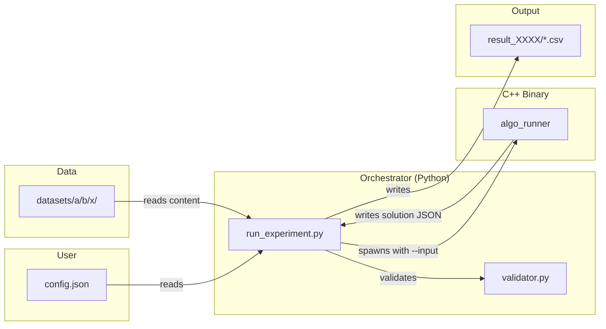

# Optimization Experiment Runner — Design

**Spec**: `.specs/features/optimization-experiment-runner/spec.md`
**Context**: `.specs/features/optimization-experiment-runner/context.md`
**Status**: Draft

---

## Architecture Overview

Four components connected by filesystem (instance files, solution JSONs, result CSVs). No network, no database, no shared memory between processes.



### Data Flow (per task)

```
Instance File ──→ Orchestrator reads content
                      │
                      ├──→ algo_runner --input='<content>' ... --output=solution.json
                      │       │
                      │       ├─ parse input ──→ start timer ──→ run algo ──→ stop timer
                      │       └─ write JSON: {selected_orders, visited_aisles, exec_time}
                      │
                      ├──→ Read solution.json
                      ├──→ validator.validate(instance_path, solution_path)
                      │       └─ returns {status, objective, gap, items, aisles}
                      │
                      └──→ Merge into result dict → buffer → later write CSV
```

---

## Code Reuse

Greenfield project — no existing code to reuse. All components are built from scratch using only the Python/C++ standard libraries.

| Component | Reuses |
| --------- | ------ |
| Python scripts | `json`, `csv`, `subprocess`, `concurrent.futures`, `pathlib`, `time`, `sys` |
| C++ binary | `<iostream>`, `<fstream>`, `<string>`, `<vector>`, `<chrono>`, `<thread>`, `<cstring>`, `<getopt.h>` |

---

## Components

### 1. algo_runner (C++)

- **Purpose**: Single CLI binary that dispatches to named algorithms, measures processing time, writes solution JSON.
- **Location**: `project/algos/algo_runner.cpp`
- **Output binary**: `project/algos/algo_runner`
- **Interfaces** (CLI):

```
./algo_runner --binary=<name>    --input='<instance>'   --params='<json>'
              --time-limit=<s>   --seed=<int>           --output=<path>
```

- **Internal structure**:

```
main()
├── parse_args()         → struct Args
│   ├── --binary: string  (required, dispatches to algorithm)
│   ├── --input: string   (required, instance content)
│   ├── --params: string  (required, JSON string)
│   ├── --time-limit: int (required, seconds)
│   ├── --seed: int       (required, RNG seed)
│   └── --output: string  (required, solution file path)
│
├── dispatch()           → (Args) → solve function
│   ├── "grasp"              → solve_grasp()
│   └── "simulated_annealing" → solve_sa()
│   └── unknown              → return 2
│
├── solve_*(args)        → Solution
│   ├── parse instance from args.input
│   ├── t_start = now()
│   ├── run algorithm loop (with time-limit check each iteration)
│   ├── t_end = now()
│   ├── exec_time = t_end - t_start
│   └── return {selected_orders, visited_aisles, exec_time}
│
└── write_json(solution, args.output) → exit 0
```

- **Dependencies**: C++17 standard library only
- **Mock behavior**: Sleep 200ms, parse input minimally, return `{"selected_orders":[],"visited_aisles":[],"exec_time":<actual_elapsed>}`
- **Build**: `g++ -O2 -std=c++17 -o project/algos/algo_runner project/algos/algo_runner.cpp`

### 2. Validator (Python)

- **Purpose**: Single source of truth for turning a solution into feasibility/objective metrics.
- **Location**: `project/validator/validator.py`
- **Interfaces**:

```python
def validate(instance_path: str, solution_path: str) -> dict:
    """Returns {status, objective, gap, items, aisles}"""

# CLI mode:
# python validator/validator.py <instance_path> <solution_path>
# → prints JSON to stdout
```

- **Placeholder logic**: Always returns `{"status": "feasible", "objective": 0.0, "gap": 0.0, "items": 0, "aisles": 0}`
- **Dependencies**: Python 3.10+ standard library only
- **Implements**: VAL-01, VAL-02, VAL-03, VAL-04

### 3. Orchestrator (Python)

- **Purpose**: Main entry point — load config, generate tasks, execute in parallel, collect results, write CSVs.
- **Location**: `project/orchestrator/run_experiment.py`
- **Interfaces**:

```
python run_experiment.py <config_path>
```

- **Internal structure**:

```
main(config_path)
├── load_config()                      → Config object
├── find_next_result_dir()             → "results/result_0001/"
├── copy_config_to_result_dir(config)
├── build_tasks(config)                → list[Task]
│   └── Cartesian product of (dataset × algorithm × instance × run_id)
│
├── run_tasks_in_parallel(tasks, n_workers)  → list[Result]
│   └── ProcessPoolExecutor(max_workers=n_workers)
│       ├── worker(task):
│       │   ├── instance_content = read_file(task.instance_path)
│       │   ├── cmd = format_algo_command(...)
│       │   ├── proc = subprocess.run(cmd, timeout=time_limit+1)
│       │   ├── if timeout:     return Result(status="timeout", exec_time=time_limit)
│       │   ├── if retcode != 0: return Result(status="error", exec_time=0.0)
│       │   ├── solution = read_json(output_path)
│       │   ├── val_result = validator.validate(instance_path, solution_path)
│       │   └── return Result(status=val_result.status, objective=...,
│       │                     gap=..., items=..., aisles=...,
│       │                     exec_time=solution["exec_time"])
│       └── collect results as they complete
│
├── write_csvs(results, result_dir)    → writes per-instance CSVs
│   ├── group by (dataset, algorithm, instance)
│   ├── create directories as needed
│   └── write header + rows per group
│
└── print_summary(results)
```

- **Config model**:

```python
@dataclass
class Config:
    datasets: dict[str, list[str]]
    algorithms: list[AlgorithmDef]
    runs_per_instance: int
    time_limit: int
    n_workers: int
```

- **Task model**:

```python
@dataclass
class Task:
    dataset: str
    algorithm_id: str
    binary: str
    params: dict
    instance: str
    instance_path: str
    run_id: int
    seed: int
```

- **Result model**:

```python
@dataclass
class Result:
    dataset: str
    algorithm: str
    instance: str
    run_id: int
    seed: int
    status: str
    objective: float
    gap: float
    items: int
    aisles: int
    exec_time: float
```

- **Verbosity**: Print `"Running N tasks with W workers..."` before dispatch. Print summary after all complete. No per-task output.
- **Failure tolerance**: Always write all CSVs, even if 100% of tasks fail. Exit code 0 always. Missing instances log a warning and are skipped.
- **Signal handling**: Register SIGINT/SIGTERM handler that kills all child processes and exits cleanly. No result files written for incomplete experiments.
- **Temp solution files**: Use `tempfile.mkstemp(dir=None)` for per-task solution JSONs. Files stay in `/tmp` after experiment (useful for debugging).
- **Grace period**: `subprocess.run(cmd, timeout=time_limit + 5)` — 5 seconds grace for slow I/O.
- **Worker count**: Use `n_workers` as-is from config, no capping at CPU count.
- **CSV row order**: Completion order (no sorting by run_id).
- **Config validation**: Minimal — check valid JSON and top-level keys only.
- **Dependencies**: Python 3.10+ standard library (`json`, `csv`, `subprocess`, `concurrent.futures`, `pathlib`, `time`, `sys`, `shutil`, `signal`, `tempfile`)
- **Implements**: ORCH-01 through ORCH-09

### 4. Analysis (Python)

- **Purpose**: Placeholder — empty file for now.
- **Location**: `project/analysis/analyze_results.py`
- **Content**: Empty file (valid Python, compiles with `py_compile`)

---

## Data Models

### Config JSON Schema

```json
{
  "datasets": {
    "<dataset_name>": ["<instance_file>", ...]
  },
  "algorithms": [
    {
      "id": "<unique_id>",
      "binary": "<binary_name>",
      "params": { "<key>": <value>, ... }
    }
  ],
  "runs_per_instance": <int>,
  "time_limit": <int>,
  "n_workers": <int>
}
```

### Solution JSON (algo_runner output)

```json
{
  "selected_orders": [1, 3, 5],
  "visited_aisles": [2, 4, 7],
  "exec_time": 1.234
}
```

### Validator Output Dict

```json
{
  "status": "feasible",
  "objective": 1250.5,
  "gap": 2.31,
  "items": 45,
  "aisles": 7
}
```

### Result CSV Schema

Columns: `run_id, seed, status, objective, gap, items, aisles, exec_time`

### Config Example

```json
{
  "datasets": {
    "a": ["instance_0001.txt", "instance_0002.txt"],
    "b": ["instance_0001.txt"]
  },
  "algorithms": [
    {"id": "grasp", "binary": "grasp", "params": {}},
    {"id": "sa", "binary": "simulated_annealing", "params": {}}
  ],
  "runs_per_instance": 3,
  "time_limit": 10,
  "n_workers": 4
}
```

---

## Error Handling Strategy

| Scenario | Detection | Handling |
| -------- | --------- | -------- |
| algo_runner bad args | Exit code 1 | Record `status=error` |
| Unknown --binary | Exit code 2 | Record `status=error` |
| algo_runner crash | Non-zero exit (not 1/2) | Record `status=error` |
| Time limit exceeded | `subprocess.TimeoutExpired` (time_limit + 5s grace) | Kill subprocess, `status=timeout` |
| Missing instance file | FileNotFoundError | Record `status=error` |
| Invalid JSON output | JSON parse error | Record `status=error` |
| No config path | `sys.argv` check | Print usage and exit 1 |
| Bad config JSON | `json.decoder.JSONDecodeError` | Print error and exit 1 |
| `results/` missing | `os.path.isdir` check | Create directory |
| Output dir exists | Check result_XXXX | Increment counter |

---

## Tech Decisions

| Decision | Choice | Rationale |
| -------- | ------ | --------- |
| Timer placement | Internal to algo_runner, after input parse | Excludes file I/O and loading from timing |
| Instance passing | `--input='<content>'` string arg | No file reads inside C++; orchestrator owns I/O |
| Result buffering | In-memory list, write once at end | No concurrent-write conflicts |
| Worker isolation | Each worker reads own instance file | No shared state; pure function per task |
| Config format | JSON | Standard, human-readable, easy to generate |
| C++ standard | C++17 | Available on target systems, modern features |
| RNG seeding | `base_seed + run_id` | Deterministic across restarts |
| Grace period | 5 seconds beyond time_limit | Generous for slow I/O or large solution writes |
| Temp file location | `tempfile.mkstemp()` in system `/tmp` | Auto-unique, stays after run for debugging |
| Signal handling | SIGINT/SIGTERM → kill children + exit | Clean shutdown, no partial result dirs |
| Verbosity | Start message + final summary only | Minimal but informative |
| Failure tolerance | Always exit 0, always write CSVs | Experiment "succeeded" in running; data shows failures |
